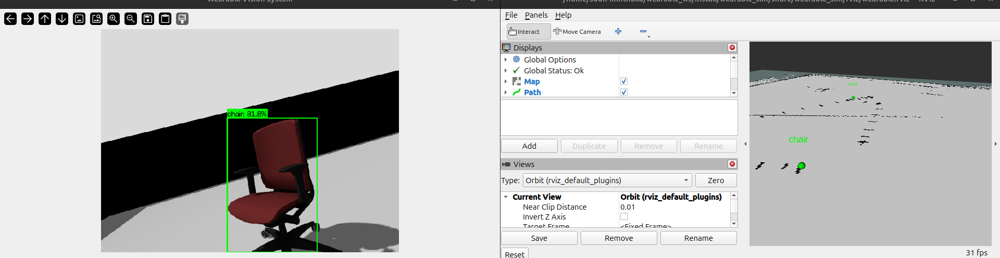
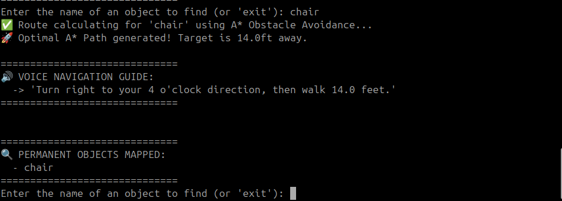

# Project Progress Tracker
Project: VisionNav - Wearable AI Guide for the Visually Impaired

---

## Week 1: Core Perception and Spatial Mapping

### Goals for this Week
* Establish the core ROS 2 Jazzy and Gazebo simulation environment.
* Build the primary AI object detection pipeline using YOLOv5.
* Implement Semantic SLAM to place detected objects onto a 2D floorplan.

### What Was Accomplished
1. Simulation Built: Successfully designed and launched the wearable chest rig URDF equipped with an RGB Camera and 2D LiDAR.
2. Zero-Lag Vision Pipeline: Wrote vision_perception.py utilizing the OpenCV C++ DNN backend. Created a frame-skipping engine that maintains 30 FPS video while running heavy AI inference at 3 FPS.
3. Advanced Semantic SLAM: Fused the LiDAR distance data with the camera's bounding boxes to drop physical 3D text markers into RViz. 
4. Spatial Confidence Merger: Implemented an algorithm to dynamically update overlapping object labels based on AI confidence levels as the user walks closer.

### Challenges and Solutions
* Challenge: The video feed was freezing due to heavy AI processing.
  * Solution: Separated the rendering and inference loops using a caching system.
* Challenge: The AI placed multiple overlapping markers when an object was misclassified from far away (e.g., Couch vs. Chair).
  * Solution: Built a spatial threshold (1.5 meters) that forces the AI to overwrite the old marker with the higher-confidence label instead of dropping a new one.

### Proof of Work

