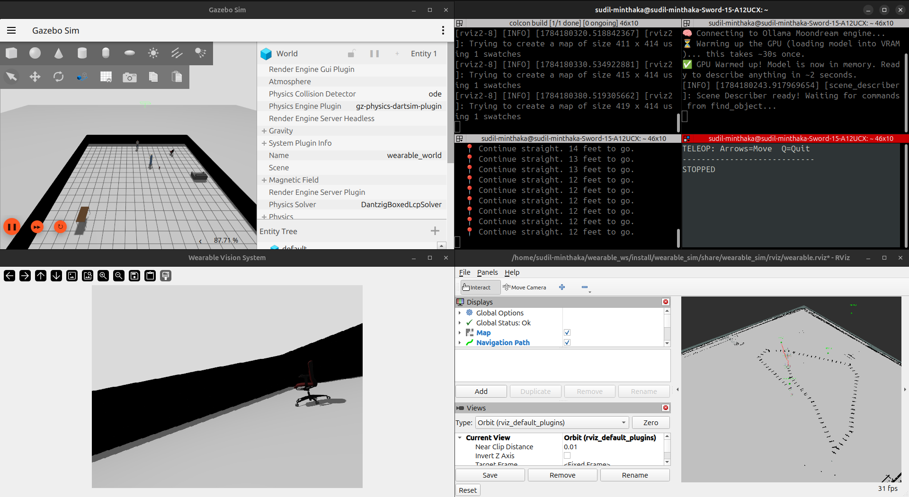

# Project Progress Tracker
Project: VisionNav - Wearable AI Guide for the Visually Impaired

---

## Week 2: Advanced Navigation, Dynamic Hazards, and Expanded AI Perception

### Goals for this Week
* Transition from basic pathfinding to continuous, turn-by-turn voice navigation.
* Fix LiDAR depth inaccuracies caused by physical obstacles blocking the raycast.
* Develop a dynamic tracking system to detect moving hazards (like vehicles or people) approaching the user.
* Deploy a Vision Language Model capable of unified object detection and in-scene text recognition (OCR).
* Maximize real-time object detection coverage and implement an offline Vision Language Model for identifying objects beyond YOLO's capabilities.

### What Was Accomplished
1. **Google Maps-Style Voice Navigation:** Refactored the A* pathfinding system to recalculate routes every 1.5 seconds. Implemented a smart voice guidance engine (Piper TTS) that provides continuous, clock-face turn instructions (e.g., "Turn left to your 10 o'clock. 25 feet remaining.") and only speaks when directions meaningfully change to avoid auditory spam.
2. **Camera-Based Depth Estimation:** Discovered and patched a critical bug where LiDAR rays hitting intermediate walls caused incorrect object placement. Implemented a Pinhole Camera Model that estimates object depth based on YOLO bounding box size, gracefully cross-referencing with LiDAR data for maximum accuracy.
3. **Dynamic Hazard Tracking:** Upgraded the AI perception system to monitor bounding box velocities for specific danger classes (`person`, `bicycle`, `car`, `truck`). If a hazard's bounding box area expands by >15% in under 1 second in the center frame, it triggers an emergency override, halting standard navigation and blasting a high-priority "EMERGENCY BRAKE" voice warning.
4. **Standalone OCR Removed:** Eliminated the fragile, dedicated Tesseract OCR script because Moondream handles text recognition perfectly natively. This simplified the architecture and reduced dependencies.
5. **Offline Vision Language Model (scene_describer.py):** Integrated moondream2, a 1.6B-parameter Vision Language Model that runs entirely offline. This enables the user to ask open-ended questions about any scene: "Is there a door nearby?", "What color is this shirt?", "Read the text on the sign." By transitioning to the lightning-fast **Ollama** engine, the AI leverages 4-bit quantization to run seamlessly on the GPU, dropping response times from 52 seconds to just 2 seconds. Furthermore, we uninstalled gigabytes of heavy Python machine learning dependencies (PyTorch, Transformers), fully replacing them with the highly optimized Ollama C++ engine.
6. **Unified Command Interface:** Upgraded the master navigation node (`find_object.py`) to accept direct terminal typing (with support for Whisper AI voice transcription). It acts as a central router, instantly passing spatial commands (`find chair`) to the navigation system and visual questions (`describe`) to the Moondream VLM.

### Multi-Layer AI Architecture
The system now uses a two-tier perception stack, all running 100% offline:

| Layer | Model | Purpose | Speed |
|---|---|---|---|
| **Layer 1** | YOLOv5m (COCO 80-class) | Real-time object detection and semantic mapping | ~3 FPS continuous |
| **Layer 2** | Moondream2 (Ollama Engine) | On-demand scene description, OCR, and open-ended Q&A | ~2 sec/query (GPU 4-bit) |

### Challenges and Solutions
* **Challenge:** RViz was silently dropping A* path messages due to timestamp mismatches between the Gazebo clock and the system clock.
  * **Solution:** Configured the ROS 2 nodes to explicitly use Gazebo's `use_sim_time` clock, syncing the path messages perfectly with the simulated world.
* **Challenge:** The LiDAR was falsely placing distant objects directly at the user's feet because the laser was hitting a physical wall between the user and the object.
  * **Solution:** Built a fallback depth-estimation algorithm using camera focal length and object bounding-box height, bypassing the blocked LiDAR ray.
* **Challenge:** The TTS engine was spamming the exact same "Go straight" instruction every 0.5 seconds, overwhelming the user.
  * **Solution:** Implemented a state-tracking variable that silences the TTS engine unless the physical instruction or turn direction actually changes.
* **Challenge:** The YOLO model can only detect 80 COCO classes, leaving 160+ everyday household items (doors, stairs, keys, plates) unrecognizable.
  * **Solution:** Deployed moondream2 as a secondary offline AI layer. Rather than retraining YOLO (which requires thousands of labeled images per class), the VLM can identify virtually any object on-demand using natural language understanding — no internet required.
* **Challenge:** The 1.6 Billion parameter VLM caused CUDA Out-of-Memory crashes on the 4GB RTX 2050. While forcing CPU inference prevented crashes, it resulted in unbearably slow 52-second response times.
  * **Solution:** Deployed the **Ollama** engine to run the model using advanced 4-bit GGUF quantization. This compressed the model down to ~1.2GB, allowing it to fit perfectly inside the GPU VRAM and instantly accelerating response times from 52 seconds down to 2 seconds.
* **Challenge:** Audio inputs were picking up random background noise, causing false navigation commands.
  * **Solution:** Transitioned the master node to a typed terminal interface, ensuring stable and intentional command routing while keeping the voice output (Piper TTS) fully intact.
* **Challenge:** The workspace was bloated with legacy ML libraries, redundant OCR tools, and leftover temporary test files.
  * **Solution:** Conducted a comprehensive workspace cleanup. We deleted 4+ GB of obsolete dependencies (PyTorch, Transformers), completely removed the fragile Tesseract OCR engine (since Moondream handles text natively), and erased leftover `.wav` and `.jpg` test files. The system is now extremely lightweight and tidy.
### Proof of Work

