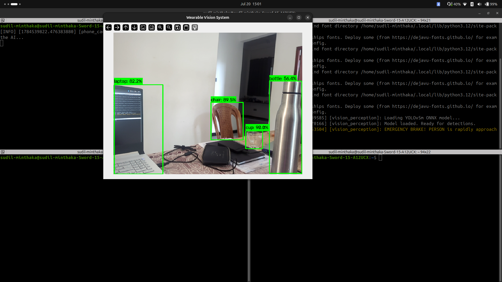
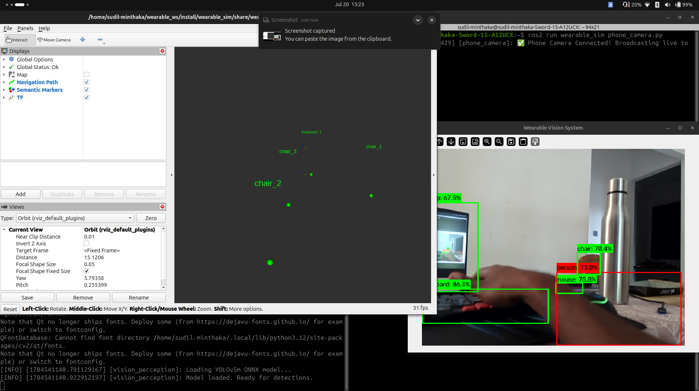

# VisionNav - Week 3 Progress Report

## Focus of the Week: Real-World Hardware Transition & Camera-Only Perception
This week, the primary objective was to transition the AI perception system out of the Gazebo simulation and into the real world, using a mobile phone as the primary RGB hardware camera.

## Key Accomplishments

### 1. Mobile Phone Hardware Integration
- Developed a new system bridge to connect an external mobile phone to act as the primary USB webcam for the physical chest rig.
- Successfully captured the live video feed and seamlessly integrated it into the ROS 2 `/camera/image_raw` perception pipeline.

### 2. Hardware-Aware 3D Mapping (LiDAR Independence)
- Overhauled the core YOLO perception engine to dynamically map objects in 3D space using only a standard RGB camera feed.
- Implemented a Pinhole Camera Math Model that estimates real-world object depth without needing a physical LiDAR sensor.
- The system remains hardware-aware, ready to instantly switch back to highly-precise laser mapping once a physical LiDAR is plugged in later.

### 3. Real-World RViz Visualization
- Created a real-world testing environment and launch file (`real_launch.py`).
- Successfully rendered live semantic objects directly from the physical phone camera into the 3D RViz spatial map.

## Week 3 Proofs
*(Insert screenshots/proofs of the working OpenCV detections and RViz 3D map here)*

* 
* 

## Next Steps
- Implement physical haptic feedback (vibration motors) or audio cues based on the real-world camera detections.
- Integrate the physical LiDAR sensor to restore SLAM functionality and precise floorplan mapping.
