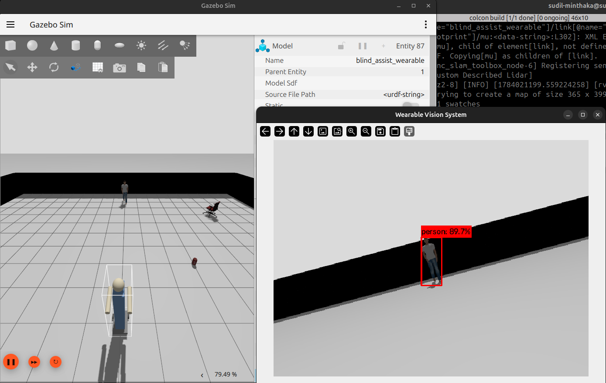

# Project Progress Tracker
Project: VisionNav - Wearable AI Guide for the Visually Impaired

---

## Week 3: Advanced Navigation, Dynamic Hazards, and Expanded AI Perception

### Goals for this Week
* Transition from basic pathfinding to continuous, turn-by-turn voice navigation.
* Fix LiDAR depth inaccuracies caused by physical obstacles blocking the raycast.
* Develop a dynamic tracking system to detect moving hazards (like vehicles or people) approaching the user.
* Build a standalone OCR (Optical Character Recognition) module to read environmental text.
* Maximize real-time object detection coverage and implement an offline Vision Language Model for identifying objects beyond YOLO's capabilities.

### What Was Accomplished
1. **Google Maps-Style Voice Navigation:** Refactored the A* pathfinding system to recalculate routes every 1.5 seconds. Implemented a smart voice guidance engine (Piper TTS) that provides continuous, clock-face turn instructions (e.g., "Turn left to your 10 o'clock. 25 feet remaining.") and only speaks when directions meaningfully change to avoid auditory spam.
2. **Camera-Based Depth Estimation:** Discovered and patched a critical bug where LiDAR rays hitting intermediate walls caused incorrect object placement. Implemented a Pinhole Camera Model that estimates object depth based on YOLO bounding box size, gracefully cross-referencing with LiDAR data for maximum accuracy.
3. **Dynamic Hazard Tracking:** Upgraded the AI perception system to monitor bounding box velocities for specific danger classes (`person`, `bicycle`, `car`, `truck`). If a hazard's bounding box area expands by >15% in under 1 second in the center frame, it triggers an emergency override, halting standard navigation and blasting a high-priority "EMERGENCY BRAKE" voice warning.
4. **Standalone OCR & TTS System:** Built a custom text-reading script utilizing OpenCV for image preprocessing (adaptive thresholding) and Tesseract OCR for text extraction. The system can successfully read labels, warning signs, and documents, parsing the text directly to the voice engine.
5. **Offline Vision Language Model (scene_describer.py):** Integrated moondream2, a 1.6B-parameter Vision Language Model that runs entirely offline. This enables the user to ask open-ended questions about any scene: "Is there a door nearby?", "What color is this shirt?", "Read the text on the sign." This addresses the 160+ everyday objects (doors, stairs, keys, plates, pillows, white cane) that the COCO dataset cannot detect. It currently runs in 16-bit precision on the CPU to bypass hardware limits.

### Multi-Layer AI Architecture
The system now uses a three-tier perception stack, all running 100% offline:

| Layer | Model | Purpose | Speed |
|---|---|---|---|
| **Layer 1** | YOLOv5m (COCO 80-class) | Real-time object detection and semantic mapping | ~3 FPS continuous |
| **Layer 2** | Moondream2 (1.6B VLM) | On-demand scene description, open-ended Q&A | ~50 sec/query (CPU 16-bit) |
| **Layer 3** | Tesseract OCR | Text extraction from signs, labels, documents | Instant |

### Challenges and Solutions
* **Challenge:** RViz was silently dropping A* path messages due to timestamp mismatches between the Gazebo clock and the system clock.
  * **Solution:** Configured the ROS 2 nodes to explicitly use Gazebo's `use_sim_time` clock, syncing the path messages perfectly with the simulated world.
* **Challenge:** The LiDAR was falsely placing distant objects directly at the user's feet because the laser was hitting a physical wall between the user and the object.
  * **Solution:** Built a fallback depth-estimation algorithm using camera focal length and object bounding-box height, bypassing the blocked LiDAR ray.
* **Challenge:** The TTS engine was spamming the exact same "Go straight" instruction every 0.5 seconds, overwhelming the user.
  * **Solution:** Implemented a state-tracking variable that silences the TTS engine unless the physical instruction or turn direction actually changes.
* **Challenge:** The YOLO model can only detect 80 COCO classes, leaving 160+ everyday household items (doors, stairs, keys, plates) unrecognizable.
  * **Solution:** Deployed moondream2 as a secondary offline AI layer. Rather than retraining YOLO (which requires thousands of labeled images per class), the VLM can identify virtually any object on-demand using natural language understanding — no internet required.
* **Challenge:** The 1.6 Billion parameter VLM caused CUDA Out-of-Memory crashes because intermediate tensors exceeded the remaining 9MB of VRAM on the 4GB RTX 2050. Standard CPU inference subsequently caused 6.4GB system RAM usage, crashing the OS.
  * **Solution:** Reverted the `transformers` library, explicitly wrapped inference in `@torch.no_grad()`, patched internal library incompatibilities (`is_training`), and forced `torch.float16` on the CPU. This successfully locks system RAM usage to a safe 3.2GB and executes 100% offline.
### Proof of Work

