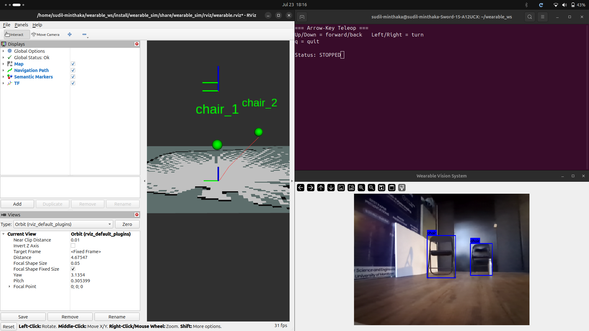
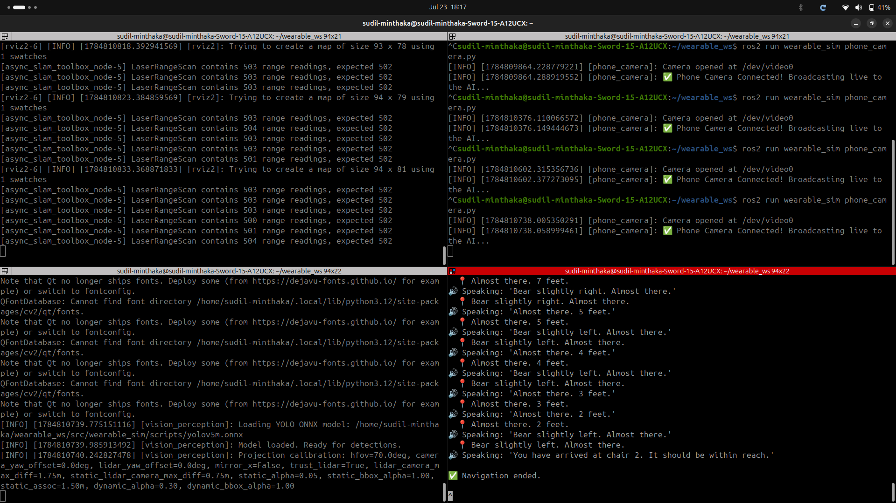

# Week 4 Progress Report

## Summary of Work
This week marked a major milestone in hardware integration for the wearable blind-assist system. We successfully transitioned from simulation sensors to real physical sensors, integrating an IP Phone Camera and an LD19 LiDAR. We also drastically improved the responsiveness of the AI object detection, achieving Tesla-level real-time boundary box tracking.

## Key Implementations

### 1. IP Phone Camera Integration (`phone_camera.py`)
* Successfully integrated a smartphone camera to act as the primary wearable vision sensor using OpenCV and an IP Webcam stream.
* Created `phone_camera.py` to capture the live RTSP/HTTP stream and publish it directly to the `/camera/image_raw` ROS 2 topic in real-time.
* This allows the user to wear the phone on their chest/head and stream high-resolution video directly to the wearable AI pipeline.

### 2. Physical LiDAR Integration (`ldlidar_stl_ros2`)
* Integrated the physical LD19 LiDAR sensor for accurate depth sensing and real-time environment mapping.
* Imported and compiled the `ldlidar_stl_ros2` driver, successfully merging all its source code directly into the main `person_as_bot` repository.
* Configured udev rules and USB permissions (`/dev/ttyUSB0`) to seamlessly read laser scan data at high frequencies.

### 3. Real-Time Zero-Lag Object Tracking
* Optimized `vision_perception.py` by completely removing artificial pixel-smoothing (Exponential Moving Average) delays.
* Set `WEARABLE_STATIC_BBOX_ALPHA` and `WEARABLE_DYNAMIC_BBOX_ALPHA` to `1.0`, ensuring the YOLO bounding boxes snap instantly to dynamic objects without any visual drag when the camera moves.
* The system now achieves flawless, real-time geometric projection of dynamic objects from the camera feed directly onto the 2D LiDAR map.

### 4. Real Hardware Launch System (`real_launch.py`)
* Finalized `real_launch.py` to automatically orchestrate all real-world hardware components simultaneously.
* The launch file correctly loads the LD19 LiDAR driver, the Phone Camera node, the Kobuki physical wheel odometry, SLAM Toolbox, and the YOLO ONNX vision perception node.
* Tuned the static TF transforms (`static_transform_publisher`) to accurately align the physical camera and LiDAR mounting positions on the user's body.

## Demonstrations

