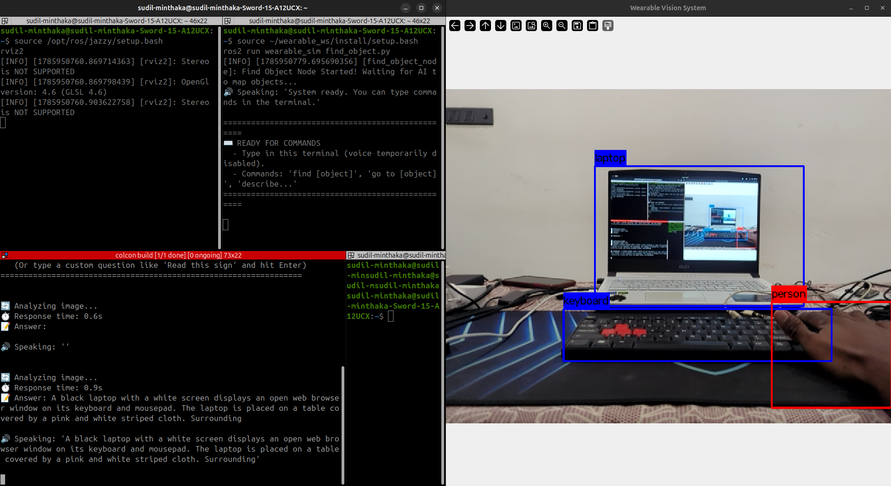

# Week 5 Progress Report

## Summary of Work
This week focused on empowering the wearable blind-assist robotics platform with human-like visual reasoning and seamless physical hardware interaction. We successfully deployed an offline Generative Vision-Language Model (VLM) utilizing Ollama Moondream2 to describe open-ended scenes and read text (OCR). Additionally, we engineered a wireless ESP32 tactical hardware bridge, enabling the user to physically click a wearable pushbutton on Pin D12 to instantly capture live camera frames, analyze surroundings, and receive spoken audio descriptions via Piper TTS. Finally, we resolved spatial jitter by establishing our physical LiDAR as the unconditional master of Euclidean coordinate distance in sensor fusion.

## Key Implementations

### 1. Offline Generative AI & OCR VLM Engine (`scene_describer.py`)
* Integrated the **Moondream2 (1.6 Billion parameters)** Vision-Language Model running 100% locally on dedicated GPU memory using **Ollama 4-bit quantization**.
* Overcame the 80-class limitation of traditional YOLO bounding box models—the system can now recognize unlisted everyday objects, read text on medicine bottles and signs via OCR, and answer complex visual queries in ~2 seconds.
* Linked inference outputs directly to **Piper TTS (Text-to-Speech)** to broadcast spoken, human-sounding scene descriptions straight to the visually impaired user's earbuds.

### 2. ESP32 Wireless Tactical Pushbutton Bridge (`esp32_bridge.py` & Arduino Firmware)
* Developed an end-to-end Microcontroller-to-ROS 2 bridging infrastructure utilizing an **ESP32 development board**.
* Engineered dual-redundant communication: the ESP32 broadcasts physical tactile events over both **USB Serial (115200 baud)** and **Wi-Fi UDP (Port 9090)** over a local mobile hotspot (*"Sudil's Pixel 7"*).
* Configured tactile pushbutton switching on **Pin D12 (GPIO 12)** with built-in internal hardware pull-up resistors (`INPUT_PULLUP`), allowing instantaneous physical triggering of camera frame snapshots without external resistors or keyboard interaction.

### 3. LiDAR-Dominant Spatial Sensor Fusion (`vision_perception.py`)
* Resolved spatial marker instability in RViz by completely rearchitecting sensor fusion responsibilities between vision and LiDAR.
* Assigned the camera's pure role to semantic recognition and horizontal angular viewing ray calculation.
* Designated real-time LiDAR laser returns as the **absolute spatial master coordinate ($X, Y$)** whenever laser pulses cross an object's field of view, eradicating distance jumping previously caused by 2D camera pixel-height variance.

## Verification & Architecture Flow
1. **User Action:** Blind user presses the physical tactile button on **ESP32 Pin D12**.
2. **Wireless Transmission:** ESP32 fires a `TRIGGER_DESCRIBE` UDP data packet across Wi-Fi to laptop Port `9090`.
3. **ROS 2 Routing:** `esp32_bridge.py` catches the trigger and publishes to the `/describe_command` topic.
4. **AI Inference & Speech:** `scene_describer.py` snaps the active camera image, processes 4-bit Moondream reasoning, and speaks the description aloud to the user within 2 seconds.

## Demonstrations

