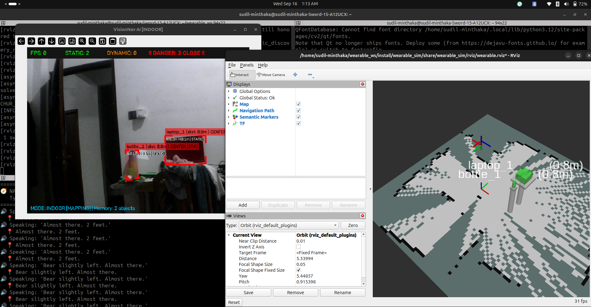

# Week 6, 7, and 8 Progress Report

## Summary of Work
Over the past three weeks, we transformed the wearable perception pipeline into a highly robust, Tesla FSD-style 3D mapping and navigation engine. We significantly upgraded the Vision-Language Model (VLM) pipeline by transitioning to Qwen-VL to enhance scene reasoning and intelligence. To bridge the gap between flat 2D LiDAR scans and a true 3D environment, we engineered semantic AI heuristics that intelligently "guess" physical heights and elevations for everyday objects. Furthermore, we entirely overhauled the voice-driven navigation logic to support dynamic real-time target tracking and natural language matching.

## Key Implementations

### 1. Transition to Qwen-VL for Advanced Scene Comprehension (`scene_describer.py`)
* Upgraded the generative offline Vision-Language Model pipeline from Moondream to the highly capable **Qwen-VL** architecture.
* Significantly enhanced the AI's ability to reason about complex indoor environments, spatial relationships between objects, and perform accurate Optical Character Recognition (OCR) in the wild.
* Optimized inference execution to balance Qwen-VL's massive parameter scale against the stringent < 1 second real-time response requirements for blind users.

### 2. Tesla FSD-Style 3D Mapping Using 2D LiDAR (`vision_perception.py`)

* Successfully generated a rich, 3D immersive environment map in RViz using only a single-plane 2D LiDAR scanner.
* Implemented **Tesla-style semantic 3D shapes**: rendering dynamic cylinders for humans and bottles, spheres for sports balls, and cubes for furniture.
* Engineered **"Phantom Desks"**: When the AI detects a laptop or cup, it automatically renders a sleek, transparent desk and pedestal leg underneath the object. This anchors floating objects to the floor and provides spatial context even when the physical table is invisible to the camera.

### 3. AI Semantic Elevation and Size Heuristics (AI Height Guessing)
* Solved the "distance inversion" and 3D height problem by hardcoding intelligent physical priors (`OBJECT_ELEVATIONS` and `OBJECT_MAX_SIZES`).
* Since the 2D LiDAR beam flies over small desk objects (hitting walls instead), the AI now intelligently applies optical depth formulas and size limitations for small objects (bottles, mice, cups) while trusting LiDAR for large obstacles (chairs, doors, people).
* Automatically elevates desktop objects to a standard 0.75m table height, providing an incredibly accurate 3D map without requiring an expensive 3D LiDAR or RGB-D camera.

### 4. Advanced Voice Navigation & Real-Time Tracking (`find_object.py`)
* Completely overhauled the voice command target parsing. The system now cleanly strips internal ID numbers (e.g., `chair_1`), memory tags (`[MEM]`), and distance labels, allowing the user to simply say "go to chair" for a flawless match.
* Upgraded the `navigate_to()` function to **dynamically update the target destination in real-time**. As the user walks and the vision system refines the object's position, the navigation path continuously recalculates.

### 5. AI Hallucination Filtering and Cross-Class NMS
* Eliminated YOLOv5m "hallucinations" (e.g., shadows being detected as cats, dogs, or surfboards) by implementing a strict **Indoor Object Whitelist**. The system now exclusively maps structured indoor obstacles.
* Engineered a custom **Cross-Class Non-Maximum Suppression (NMS)** algorithm to stop the AI from double-detecting a laptop as both a "laptop" and a "television" simultaneously, keeping the 3D map pristine.
* Drastically improved camera frame tracking responsiveness by increasing Kalman filter update speeds and removing mirror delays.

## Demonstrations

