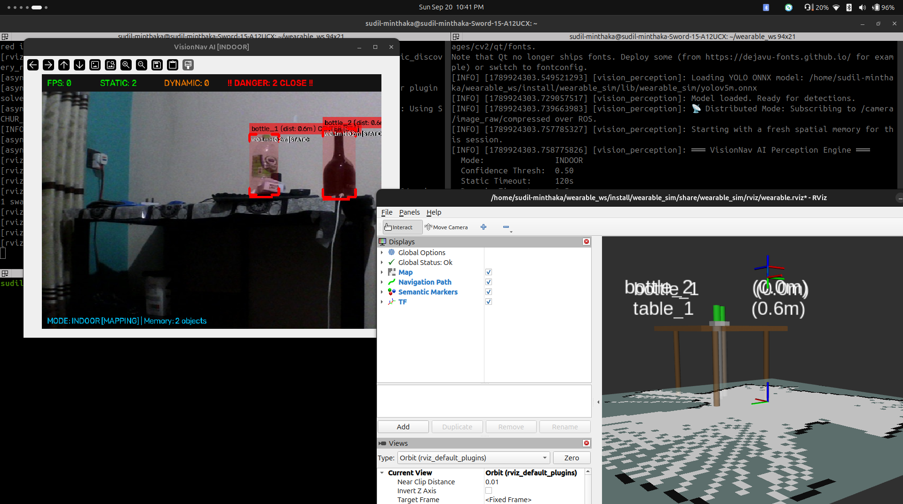

# Week 9 Progress Report

## Summary of Work
This week, we took our spatial perception pipeline to the next level by transitioning from static hardcoded rulebooks to dynamic geometric mathematics and advanced tracking kinematics. We replaced the artificial height assumptions (semantic priors) with an intelligent "Optical Geometric Drop Estimation" model, allowing the system to mathematically derive true 3D elevations of objects directly from the 2D camera frame. Furthermore, we drastically enhanced our dynamic object tracking architecture by upgrading our Kalman filters to track acceleration and implementing SORT-style data association, which makes the 3D map hyper-responsive and nearly eliminates tracking glitches during occlusion.

## Key Implementations

### 1. Dynamic Object Elevation & Sizing via Optical Pinhole Geometry
* Eliminated the system's reliance on hardcoded height heuristics (e.g., assuming all tables are 0.75m tall). 
* Implemented a true geometric calculation using the bounding box bottom coordinate (`y2`) and the camera's fixed height off the floor (`WEARABLE_CAMERA_HEIGHT`). 
* The system now utilizes the formula `drop_distance = depth * math.tan(elevation_rad)` to calculate the exact physical drop from the camera lens down to the base of the object, assigning dynamically accurate Z-axis elevations for tables, counters, and floors.

### 2. Advanced Kinematics (6-State Kalman Tracker)
* Completely overhauled the `KalmanTracker` class, upgrading it from a basic 4-state constant velocity model to an advanced **6-State Constant Acceleration Model** (`[X, Y, Vx, Vy, Ax, Ay]`).
* The AI now natively understands non-linear paths, meaning it can accurately predict curved trajectories and sudden braking for dynamic objects like people and vehicles, rather than assuming straight-line motion.

### 3. ByteTrack/SORT-Style Multi-Factor Data Association
* Rewrote the data association logic for the trackers. The previous system relied strictly on 2D Euclidean distance, causing IDs to swap when two objects crossed paths.
* Implemented a multi-factor tracking cost metric that combines both 3D Euclidean distance and a **3D Bounding Box Size Penalty** (acting as a lightweight Intersection-over-Union/IoU proxy). 
* The system now heavily penalizes size mismatches during tracking, meaning if a tall person walks in front of a short object, the tracker maintains perfect ID continuity through the occlusion.

### 4. Hyper-Responsive Dynamic Object Clean-up 
* Identified and fixed an issue where dynamic objects (people, cars) would leave permanent "ghost traces" on the map, and lag on screen after leaving the camera view.
* Dramatically reduced the AI tracker's dynamic memory timeout to `0.5s` and configured separate rendering lifetimes for RViz (`2.5s` for static layout vs `0.6s` for dynamic agents).
* Moving objects now vanish instantly the moment they exit the camera frame, keeping the spatial map highly responsive.

### 5. Out-of-Frame Drift Physics and Friction
* Addressed an edge case where the newly added Constant Acceleration tracker caused out-of-frame static objects (like bottles) to slowly drift infinitely across the map due to predictive noise.
* Injected a virtual "friction" decay function (`x *= 0.80`) into the prediction loop for unobserved objects.
* Explicitly locked velocity and acceleration states to absolute `0.0` for all static semantic classes, ensuring desktop objects stay firmly glued to their dynamically-calculated tables.

## Demonstrations

